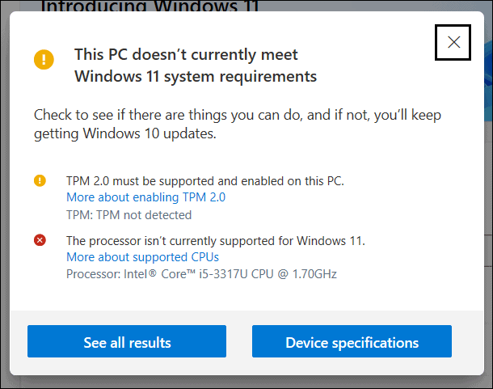
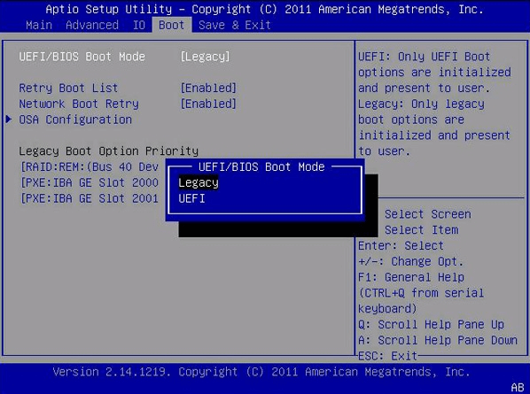
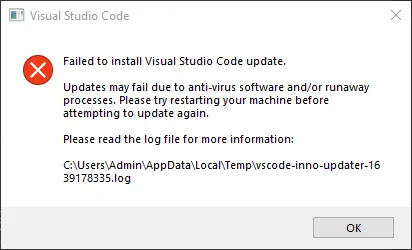

Developer Environment Setup 

1. Windows 11 Setup 

   1. Installation 
      1. Download the Windows 11 installation media from the official Microsoft website or through the Media Creation Tool.
      2. Download an ISO file, create a bootable USB drive using tools like Rufus or the Media Creation Tool provided by Microsoft.
      3. Insert the bootable USB drive into your PC and restart it.
      4. Enter the BIOS or UEFI firmware settings (usually by pressing a key like F2, F12, Esc, or Del during startup) and set the USB drive as the primary boot device.
      5. Save changes and exit BIOS/UEFI.
      6. The Windows 11 installation process should begin. Follow the on-screen instructions to complete the installation.
  
   2. Troubleshooting 
      1. Windows 11 has specific hardware requirements (like TPM 2.0 and Secure Boot) that your computer must meet. If your system does not meet these requirements, you won't be able to install Windows 11.
      
      2. Incorrect BIOS or UEFI settings can prevent the installation. Ensure that Secure Boot is enabled. 
      

2. Visual Studio Code (VS Code) Setup 
   1. Installation
      1. Visit the official Visual Studio Code website at code.visualstudio.com
      2. Click on the "Download" button to download the installer suitable for your operating system (Windows).
      3. Once the download is complete, run the installer file you downloaded (it's usually named VSCodeSetup.exe on Windows).
      4. The installation wizard will guide you through the installation process. Click "Next" to proceed to next step. 
      5. During the installation, you may have the option to choose additional components or specify installation directories. Follow the prompts as per your requirements.
      6. Once the installation completes, you can launch Visual Studio Code. On Windows, it typically adds an icon to your desktop and Start Menu.
      7. Upon launching VS Code for the first time, you might be prompted to install recommended extensions. You can choose to install these extensions based on your preferences or skip this step and install them later.
   2. Troubleshooting 
      1. Try running the installer as an administrator by right-clicking the installer file and selecting "Run as administrator."
      2. Antivirus or security software can interfere with the installation process, mistaking the installer or VS Code itself as a potential threat. Temporarily disable antivirus software during installation, if necessary, and ensure VS Code is added to any whitelist or exception list.
      

3. Git and Github 
   1. Git Installation 
      1. Visit the official Git website: https://git-scm.com/ and download the installer for Windows.
      2. Once downloaded, run the installer (Git-*.exe).
      3. Follow the prompts in the installer (accept the default settings).
      4. After installation, open Command Prompt (cmd) or Git Bash (installed with Git) and type "git --version" to verify that Git is installed and accessible.
      5. After installing Git, you need to configure it with your identity (username and email), which will be used for all your Git commits. Type the following commands on cmd:
         git config --global user.name "Your Name"
         git config --global user.email "your.email@example.com"
   2. GitHub set-up 
      1. Open your web browser and go to github.com.
      2. On the GitHub homepage, you'll see a "Sign up" section. Fill out the form with the following details:
         Username: Choose a unique username for your GitHub account. If the username is already taken, GitHub will prompt you to choose a different one.
         Email Address: Enter your email address. This will be used for account notifications and communication from GitHub.
         Password: Create a strong password for your account.
      3. Complete any CAPTCHA or verification process to confirm you are not a robot.
      4. After filling out the form, click on the green button labeled "Create Account". 
      5. GitHub will send a verification email to the email address you provided. Check your email inbox for an email from GitHub and click on    the verification link within the email to verify your email address.
      6. Once your email address is verified, you'll be redirected to the GitHub website where you can start using your GitHub account.

4. Python 
   1. Installation 
      1. Visit the official Python website: python.org.
      2. Navigate to the Downloads section and click on the latest version of Python .
      3. Once the download completes, run the installer (python.exe).
      4. Ensure to check the box that says "Add Python 3.10 to PATH" during the installation process to make Python accessible from the command line.
      5. Follow the prompts in the installer to complete the installation. Accept the default settings unless you have specific preferences.
      6. Open Command Prompt (cmd) and type python --version or python3 --version to verify that Python is installed correctly. You should see the version number of Python you installed.
   2. Extra Packages 
      1. Python comes with a package manager called pip (or pip3 for Python 3). You can use pip to install additional Python packages.
         Type the following command on the cmd 
         pip install package_name
         replace "package_name" with the name of the package. 
   3. Virtual Environments 
      1.  It's recommended to use virtual environments (venv or virtualenv) when working on Python projects to isolate dependencies. You can create a virtual environment with:
      python -m venv myenv
      2. Activate the virtual environment:
         myenv\Scripts\activate

5. MySQL 
   1. Downloading 
      1. Go to the MySQL Community Downloads page: https://dev.mysql.com/downloads/mysql/.
      2. Choose the appropriate installer for your operating system (Windows, macOS, or Linux). The recommended installer is typically MySQL Installer for Windows. 
      3. Click on the download button to save the installer file to your computer.
   2. Installation 
      1. Double-click the downloaded installer file (mysql-installer-community-*.*.*.*.msi).
      2. The MySQL Installer wizard will open.
      3. Select "Developer Default" setup type, which installs MySQL Server, MySQL Workbench, and other useful tools. Click "Next".
      4. Follow the prompts in the installer to complete the installation.
      5. During the installation, you'll be prompted to configure MySQL Server. Set a root password for MySQL (make sure to remember this password as it will be needed later).
      6. Ensure that "Start MySQL Server at System Startup" is checked during installation to automatically start MySQL Server when your computer boots up.
      7. Once the installation completes, click "Finish" to exit the MySQL Installer wizard.
   3. Configuration 
      1. Open MySQL Workbench (if installed) or connect to MySQL Server using the MySQL command-line client (mysql).
      2. Use the root user and the password you set during installation to log in:
      3. If needed, create a new MySQL user and grant necessary privileges.
      4. Create a new MySQL database if needed.
      5. Exit the MySQL client.
   4. Troubleshooting 
      1. MySQL configuration file (my.cnf or my.ini) can be found in the MySQL installation directory. Adjust settings like port, memory usage, etc., if necessary.
      2. If you have a firewall enabled, ensure that it allows connections to MySQL Server on the appropriate port (usually 3306).

6. Extensions and other extras 
   1. Extensions 
       1. Launch Visual Studio Code on your computer.
       2. Click on the Extensions icon in the Activity Bar on the side of the VS Code window, or use the shortcut Ctrl+Shift+X 
       3. In the Extensions view, you can search for extensions by typing keywords in the search box. 
       4. Browse through the list of extensions that match your search. Click on an extension to view its details.
       5. Click the "Install" button next to the extension you want to install.
       6. You may be prompted to reload VS Code to activate the extension. Click "Reload" to apply the changes.
   2. Plugins 
      1. Additional language support or tools within specific extensions, such as linters, formatters, or debuggers, these are typically included or configurable within the extension itself. For example, the Python extension includes support for linters like Flake8 or Pylint, debuggers like the Python Debugger, and more.

